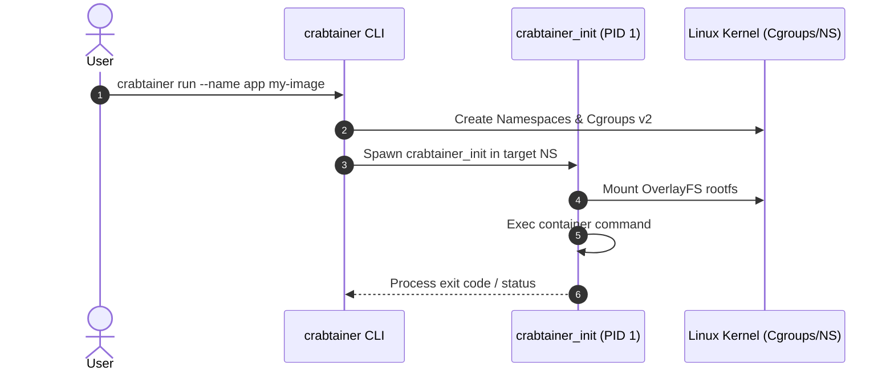

# Architecture Overview

Crabtainer follows a **daemonless model** inspired by Podman.

## Running a container

## Key Architectural Concepts

1. **No Background Daemon:** Eliminates single point of failure and continuous background resource overhead.
2. **`crabtainer_init` (PID 1):** A dedicated, minimal Rust binary injected inside the container environment to handle signal forwarding, process reaping, and clean exit statuses.
3. **Storage & Isolation:** Uses Linux OverlayFS for layer composition and `cgroups v2` (`cgr
